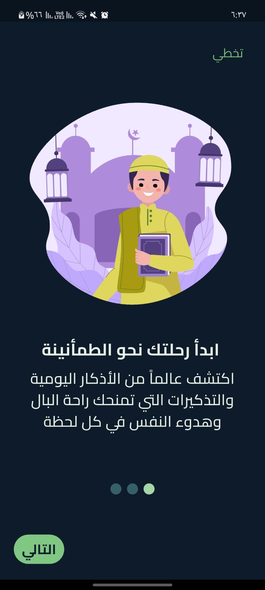
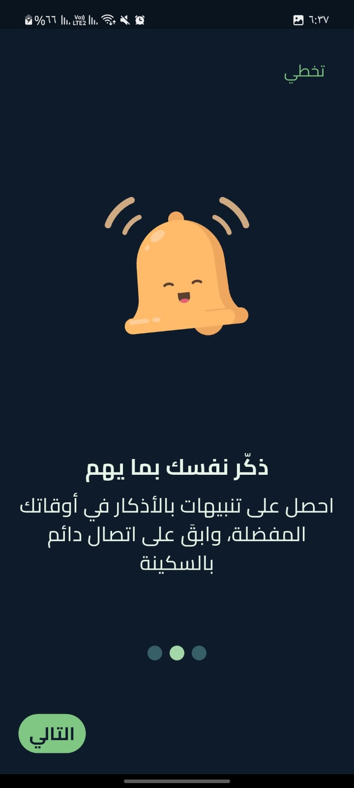
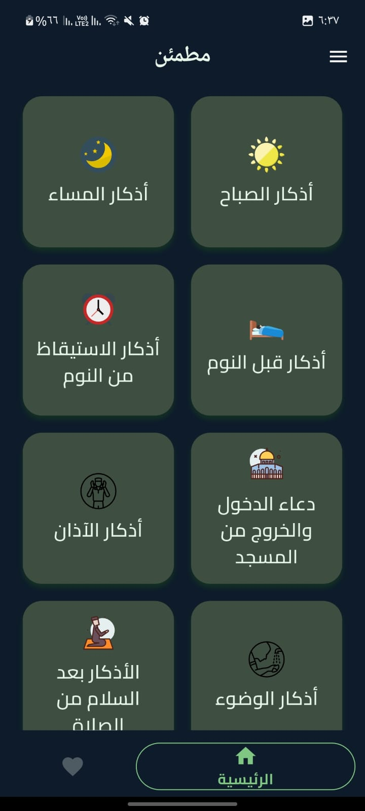
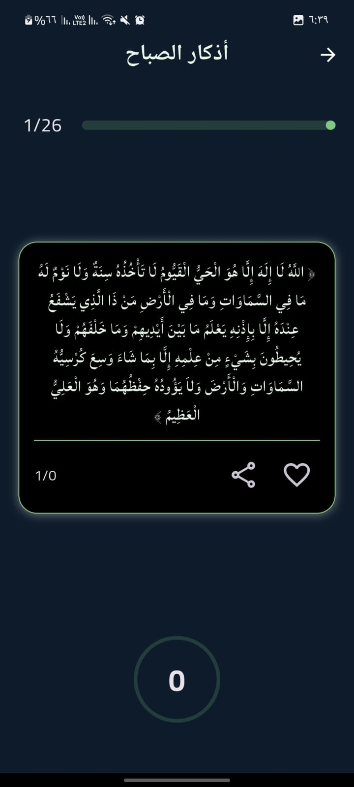
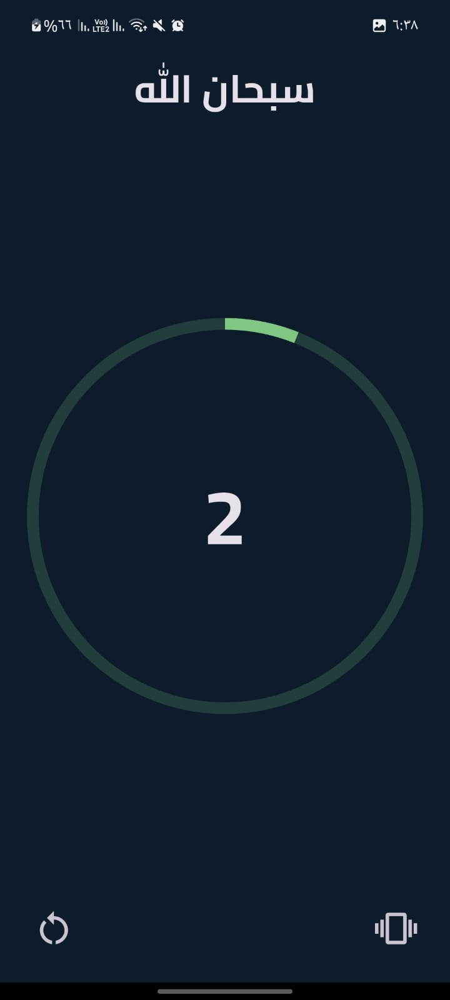

# Azkar App

A Flutter application for displaying and managing Islamic Azkar (supplications).

## Features

- **Azkar Page:** Read Azkar from a local JSON file.
- **Digital Tasbeeh:** Use a digital counter for your Tasbeeh.
- **Favorites:** Save your favorite Azkar for quick access.
- **Notifications:** Get daily reminders for Azkar.
- **Customizable Themes:** Personalize the app's appearance.
- **Audio Playback:** putting sound effect during tasbeeh.
- **Share:** Share Azkar with your friends and family.
- **Onboarding Screens:** A simple and intuitive introduction to the app.
- **Localization:** Available in Arabic.

## Getting Started

To get a local copy up and running, follow these simple steps.

### Prerequisites

- Flutter SDK: [https://flutter.dev/docs/get-started/install](https://flutter.dev/docs/get-started/install)

### Installation

1. Clone the repo
   ```sh
   git clone https://github.com/Ahmed-Mamdouh-Elattar/azkar_app.git
   ```
2. Install packages
   ```sh
   flutter pub get
   ```
3. Run the app
   ```sh
   flutter run
   ```

## Dependencies

- [flutter_bloc](https://pub.dev/packages/flutter_bloc): For state management.
- [objectbox](https://pub.dev/packages/objectbox): For local database.
- [just_audio](https://pub.dev/packages/just_audio): For audio playback.
- [flutter_local_notifications](https://pub.dev/packages/flutter_local_notifications): For local notifications.
- [workmanager](https://pub.dev/packages/workmanager): For background tasks.
- [and more...](pubspec.yaml)

## Screenshots


| Onboarding 1 | Onboarding 2 | Onboarding 3 |
| :---: | :---: | :---: |
|  |  |  |

| Home | Azkar Page | Digital Tasbeeh |
| :---: | :---: | :---: |
|  |  |  |
